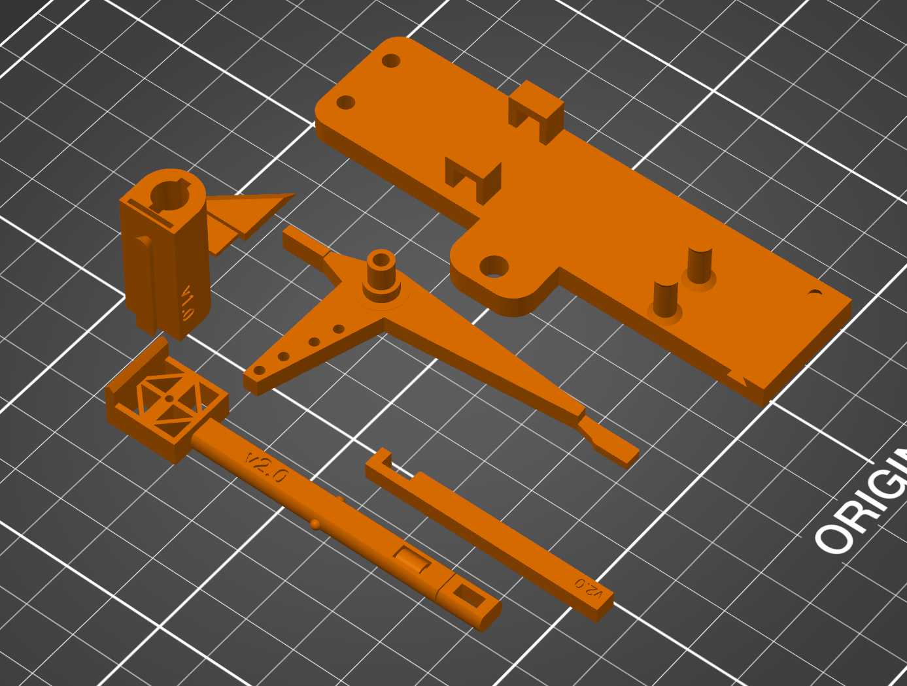

# BigBrain Retractable Purge Mechanism

This is a project inspired by the BigBrain excellent Retractable Purge Mechanism (https://www.bigbrain3d.com/product/retractable-purge-mechanism/). I liked it a lot, but had issues with how the blobs would sometimes go flying all over when the "flicker" would strike it. This design incorporates a mechanism that rotates the tack carriage as it retracts and scrapes the blob off with a blade.

